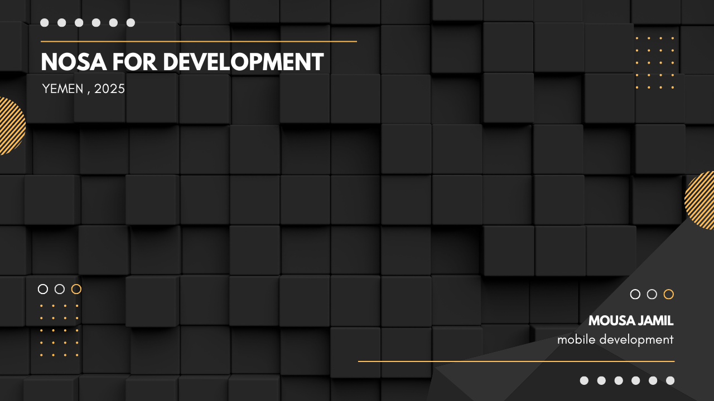
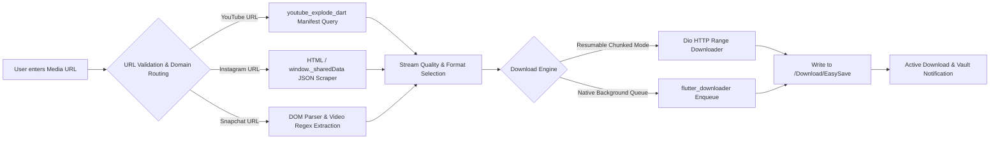
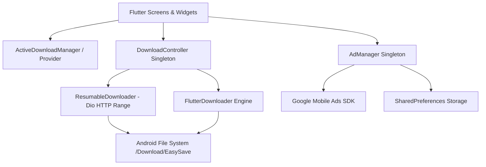
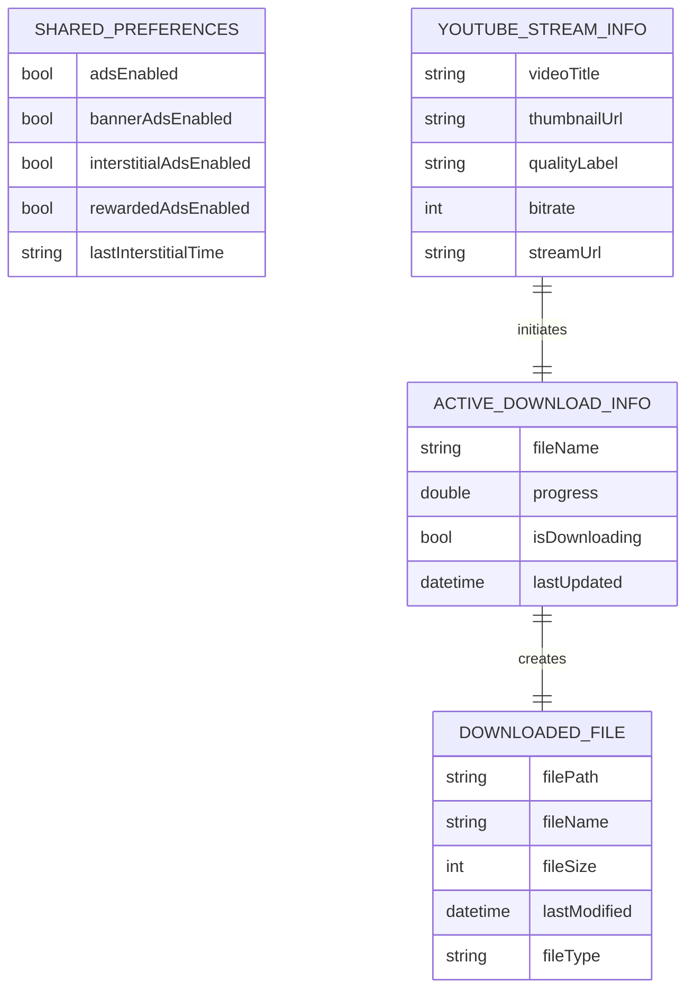

<div align="center">


# EasySave

**High-Performance Cross-Platform Media Downloader & Stream Extraction Engine**


</div>

> **Hero view — Multi-Source Media Downloading Workspace**
>
> [](<Screenshots/Screenshot_٢٠٢٥٠٤١٥-٢٠٥٧٣٩.jpg>)
>
> A unified mobile console for YouTube stream extraction, Instagram Reels parsing, Snapchat stories downloading, resumable HTTP range transfers, and local media vault management.
>
> واجهة تشغيل موحدة لاستخراج تدفقات يوتيوب، وتحليل ريلز إنستغرام، وتنزيل قصص سناب شات، والنقل القابل للاستئناف عبر HTTP Range، وإدارة خزينة الوسائط المحلية.

---

## Table of Contents | فهرس المحتويات

- [Overview](#overview--نظرة-عامة)
- [Quick Start](#quick-start--بدء-سريع)
- [Quick Facts](#quick-facts--حقائق-سريعة)
- [Why This Project?](#why-this-project--لماذا-هذا-المشروع)
- [System Scope](#system-scope--نطاق-النظام)
- [Screenshots](#screenshots--لقطات-الشاشة)
- [Key Features](#key-features--الميزات-الرئيسية)
- [Module Overview](#module-overview--نظرة-عامة-على-الوحدات)
- [System Workflow](#system-workflow--سير-العمل)
- [Engineering Highlights](#engineering-highlights--نقاط-الإبداع-والتميز)
- [Technology Stack](#technology-stack)
- [Architecture Overview](#architecture-overview--نظرة-عامة-على-المعمارية)
- [Engineering Decisions](#engineering-decisions--القرارات-الهندسية)
- [Performance Considerations](#performance-considerations--اعتبارات-الأداء)
- [Technical Challenges](#technical-challenges--التحديات-التقنية)
- [UI/UX Design](#uiux-design)
- [Installation & Configuration](#installation--configuration--التثبيت-والإعداد)
- [Project Structure](#project-structure)
- [Services Provided](#services-provided)
- [API Overview](#api-overview)
- [Database Overview](#database-overview--نظرة-عامة-على-قاعدة-البيانات)
- [Security](#security--الأمان)
- [Deployment](#deployment--النشر)
- [Roadmap](#roadmap--خارطة-الطريق)
- [Development Team](#development-team)

---

## Overview | نظرة عامة

🇺🇸 **English**

EasySave is a multi-platform media downloader application built with Flutter and Dart. It unifies YouTube stream extraction (muxed video+audio, video-only, and audio-only MP3/M4A), Instagram Reels scraper parsing, Snapchat story video extraction, and resumable HTTP range-based background downloading into a single mobile interface. Designed for mobile users requiring high-speed offline media preservation, the app combines native Android file system management, reactive state singletons, and monetization controls through Google Mobile Ads.

🇸🇦 **العربية**

إيزي سيف (EasySave) تطبيق متعدد المنصات لتحميل الوسائط تم بناؤه باستخدام فلاتر (Flutter) ودارت (Dart). يجمع التطبيق بين استخراج تدفقات يوتيوب (فيديو مع صوت، فيديو فقط، وصوت فقط بصيغة MP3/M4A)، وتحليل وتنزيل ريلز إنستغرام، واستخراج مقاطع قصص سناب شات، مع التنزيل في الخلفية القابل للاستئناف عبر بروتوكول HTTP Range في واجهة جوال موحدة. صُمم التطبيق للمستخدمين الذين يحتاجون لحفظ الوسائط دون اتصال بسرعة عالية، ودمج إدارة نظام الملفات للأندرويد، وأنماط Singleton للتحكم في الحالة، ونظام الإعلانات عبر Google Mobile Ads.

---

## Quick Start | بدء سريع

🇺🇸 **English**

The repository contains a standard Flutter project layout configured for Android and iOS builds, requiring the Flutter SDK (>=3.7.0) and Dart runtime.

🇸🇦 **العربية**

يحتوي المستودع على هيكل مشروع Flutter قياسي مهيأ لبناء تطبيقات Android وiOS، ويتطلب وجود Flutter SDK (>=3.7.0) وبيئة تشغيل Dart.

```bash
git clone https://github.com/mosaa65/EasySave-Flutter-Downloader.git
cd EasySave-Flutter-Downloader
flutter pub get
flutter run
```

Configure required Android storage permissions and AdMob App IDs as described in [Installation & Configuration](#installation--configuration--التثبيت-والإعداد).

اضبط صلاحيات التخزين المطلوبة في أندرويد ومعرفات تطبيق AdMob كما هو موضح في قسم [التثبيت والإعداد](#installation--configuration--التثبيت-والإعداد).

---

## Quick Facts | حقائق سريعة

| Item | Value |
| --- | --- |
| Project type | Cross-Platform Mobile Media Downloader & File Manager |
| Architecture | Layered Flutter Application with Singleton Managers & Reactive Providers |
| Frontend | Flutter SDK, Material Design 3, Custom Typography & Marquee Animations |
| Downloader Engine | `Dio` Resumable HTTP Chunking & Native `flutter_downloader` Enqueueing |
| Storage & Cache | Android Shared External Directory (`/Download/EasySave`) & `SharedPreferences` |
| Deployment | Android APK / Bundle target (`flutter build apk`) |
| License | MIT License |

---

## Why This Project? | لماذا هذا المشروع؟

🇺🇸 **English**

Downloading social media content often requires switching between clunky web converters, dealing with expired links, or losing download progress on unstable networks. EasySave solves these challenges by implementing client-side media resolution directly within the mobile application. By pairing `Dio` HTTP range headers for pause/resume capability with native background download task queueing, EasySave delivers a reliable offline media saving experience across YouTube, Instagram, and Snapchat.

🇸🇦 **العربية**

غالباً ما يتطلب تنزيل محتوى وسائل التواصل الاجتماعي التنقل بين أدوات الويب بطيئة الأداء، أو التعامل مع الروابط المنتهية، أو فقدان تقدم التحميل عند ضعف التغطية. يعالج إيزي سيف هذه التحديات عبر تنفيذ عمليات استخراج الوسائط مباشرة داخل تطبيق الجوال. ومن خلال الربط بين ترويسات HTTP Range في Dio لدعم الإيقاف والإكمال، ونظام `flutter_downloader` للتحميل في الخلفية، يقدم التطبيق تجربة حفظ وسائط موثوقة من يوتيوب وإنستغرام وسناب شات.

---

## System Scope | نطاق النظام

🇺🇸 **English**

- **YouTube Extraction:** Full stream manifest parsing for muxed video/audio, video-only resolutions (1080p, 720p, 480p, 360p), and high-bitrate audio-only extraction (MP3 / M4A) via `youtube_explode_dart`.
- **Social Media Scraper:** Instagram Reels scraper extracting direct MP4 URLs from `window._sharedData` script structures and Regex fallbacks; Snapchat stories video scraper.
- **Resumable HTTP Downloader:** Range-based chunked downloading using `Dio` cancel tokens, allowing users to pause, resume, and track active byte byte counts.
- **Vault File Manager:** Integrated file browser displaying saved media in `/storage/emulated/0/Download/EasySave`, featuring list/grid view toggling, native media opening (`open_file`), and system sharing (`share_plus`).
- **Ad Monetization & Controls:** AdMob integration (`google_mobile_ads`) managing Banner, Interstitial (with 5-minute throttling), and Rewarded ads, complete with user control toggles via `SharedPreferences`.

🇸🇦 **العربية**

- **استخراج يوتيوب:** تحليل كامل لتدفقات يوتيوب للجودات المدمجة، والفيديو المباشر (1080p, 720p, 480p, 360p)، والصوت المستقل عالي الجودة (MP3 / M4A) عبر `youtube_explode_dart`.
- **كشط منصات التواصل:** أداة استخراج ريلز إنستغرام بروابط مباشرة من كائنات `window._sharedData` وأنماط Regex؛ واستخراج مقاطع قصص سناب شات.
- **محرك التنزيل القابل للاستئناف:** تنزيل مجزأ يعتمد على HTTP Range باستعمال رموز إلغاء `Dio` لإتاحة الإيقاف المؤقت والإكمال وتتبع البايتات المحملة.
- **خزينة إدارة الملفات:** متصفح ملفات مدمج يستعرض الوسائط في `/storage/emulated/0/Download/EasySave` مع تبديل العرض بين الشبكة والقائمة، وفتح الملفات بالنظام (`open_file`)، والمشاركة (`share_plus`).
- **إدارة وحوكمة الإعلانات:** دمج شبكة AdMob لإعلانات البانر، الإعلانات البينية (مع مهلة 5 دقائق بين ظهور آخر)، وإعلانات المكافأة، مع خيارات التحكم والتعطيل للمستخدم بـ `SharedPreferences`.

---

## Screenshots | لقطات الشاشة

🇺🇸 **English**

Select any image or video demonstration to view it at full size. The verified UI captures and video recordings live in `Screenshots/`.

🇸🇦 **العربية**

اضغط على أي صورة أو عرض مرئي لمشاهدته بالحجم الكامل. توجد لقطات الواجهة والتسجيلات الموثقة في `Screenshots/`.

### Core Application & Downloader Workspace | الواجهة الرئيسية ومساحة التنزيل

| Downloader Workspace | Main Dashboard | Promotional Banner |
| --- | --- | --- |
| [](<Screenshots/Screenshot_٢٠٢٥٠٤١٥-٢٠٥٧٣٩.jpg>)<br><sub>Downloader — Stream resolution & link input</sub> | [](<Screenshots/Screenshot_٢٠٢٥٠٤٠٣-٢٢٤٩٠٩.jpg>)<br><sub>Home — Main navigation & category services</sub> | [](assets/banner.jpg)<br><sub>Promotional Banner — In-app offer banner</sub> |

### Mobile Experience & Media Vault | تجربة الجوال وخزينة الملفات

| Stream Resolution | Format Selection | Active Downloads & Vault |
| --- | --- | --- |
| [](<Screenshots/Screenshot_٢٠٢٥٠٦١٦-٠٢٥٣٤٩.jpg>)<br><sub>Mobile — YouTube stream resolution</sub> | [](<Screenshots/Screenshot_٢٠٢٥٠٦١٦-٠٢٥٣٥٢.jpg>)<br><sub>Mobile — Muxed & audio stream quality tiers</sub> | [](<Screenshots/Screenshot_٢٠٢٥٠٦١٦-٠٢٥٣٥٨.jpg>)<br><sub>Mobile — Live progress & downloaded files</sub> |

### Video Demonstrations & Workflows | العروض المرئية ومسارات العمل

| Resumable Transfers Flow | Media Vault & File Operations | Instagram Reels Extraction |
| --- | --- | --- |
| <video src="Screenshots/Screen%20Recording%2020260123-214030.mp4" controls width="100%"></video><br><sub>Video — Range-based resumable downloads</sub> | <video src="Screenshots/Screen%20Recording%2020250420-022642%20-%20Copy.mp4" controls width="100%"></video><br><sub>Video — Media vault preview & sharing</sub> | <video src="Screenshots/Screen%20Recording%2020250419-000628%20-%20Copy.mp4" controls width="100%"></video><br><sub>Video — Instagram Reels extraction</sub> |

| Snapchat Story Scraper | Audio Extraction & MP3 | Background Execution & Ads |
| --- | --- | --- |
| <video src="Screenshots/Screen%20Recording%2020250419-021602%20-%20Copy%20-%20Copy.mp4" controls width="100%"></video><br><sub>Video — Snapchat story video scraper</sub> | <video src="Screenshots/Screen%20Recording%2020250408-161326%20-%20Copy%20-%20Copy.mp4" controls width="100%"></video><br><sub>Video — Audio-only MP3/M4A extraction</sub> | <video src="Screenshots/Screen%20Recording%2020250418-235442%20-%20Copy%20-%20Copy.mp4" controls width="100%"></video><br><sub>Video — Background execution & AdMob integration</sub> |

---

## Key Features | الميزات الرئيسية

🇺🇸 **English**

- 🎥 **Multi-Source Extraction:** Downloads videos and audio from YouTube, Instagram Reels, and Snapchat stories.
- ⏯️ **Resumable HTTP Transfers:** Range-header based chunked transfers allowing seamless pause and resume operations without data loss.
- 🚀 **Background Execution:** Queues downloads with native OS notification integration via `flutter_downloader`.
- 📁 **Media Vault & Sharing:** Full-featured file manager with grid/list view, instant file playback, and native OS cross-file sharing.
- 🎨 **Rich Typography & Material 3:** Custom Arabic and Latin font families (Cairo, PoetsenOne, Pacifico, ElMessiri) with dark mode themes.
- 🛡️ **Granular Permission Handling:** Android 11+ storage access compliance with `MANAGE_EXTERNAL_STORAGE` and explicit permission guards.

🇸🇦 **العربية**

- 🎥 **استخراج متعدد المصادر:** تنزيل الفيديوهات والصوتيات من يوتيوب، ريلز إنستغرام، وقصص سناب شات.
- ⏯️ **نقل مجزأ قابل للاستئناف:** نقل يعتمد على HTTP Range يسمح بالإيقاف المؤقت والإكمال بسلاسة دون فقدان البيانات.
- 🚀 **تنفيذ في الخلفية:** إضافة التحميلات إلى قائمة الانتظار مع إشعارات نظام التشغيل المحلية عبر `flutter_downloader`.
- 📁 **خزينة الوسائط والمشاركة:** مدير ملفات كامل مع خيارات التبديل بين القائمة والشبكة، وتشغيل الملفات والمشاركة عبر النظام.
- 🎨 **خطوط عصرية وMaterial 3:** خطوط عربية ولاتينية مخصصة (Cairo, PoetsenOne, Pacifico, ElMessiri) ودعم الوضع الداكن.
- 🛡️ **إدارة دقيقة للصلاحيات:** توافق كامل مع صلاحيات Android 11+ مثل `MANAGE_EXTERNAL_STORAGE` مع حماية من رفض الإذن.

---

## Module Overview | نظرة عامة على الوحدات

🇺🇸 **English**

The modules below represent functional engineering components in the codebase.

🇸🇦 **العربية**

تُعبّر الوحدات التالية عن المكونات الهندسية الوظيفية داخل قاعدة البيانات البرمجية.

| Module | Purpose | Responsibilities and Main Capabilities |
| --- | --- | --- |
| Home & Navigation Screen | Primary app entry point. | Manages main dashboard view, category chips, promotion banners, and navigation routing to specific downloaders. |
| YouTube Downloader Suite | Extract YouTube video/audio streams. | Queries stream manifests using `youtube_explode_dart`, presents quality tiers (Muxed/Video/Audio), and initiates downloads. |
| Social Scraper Suite | Extract media from social media pages. | Parses Instagram HTML/JSON structure for Reel MP4 links and scrapes Snapchat story video endpoints. |
| Resumable Engine | High-speed range downloader. | Wraps `Dio` requests with `bytes=X-` Range headers, managing cancel tokens, partial file byte counts, and resume states. |
| Active Download Manager | Global download state observer. | Maintains active download metadata list, emitting live progress updates via `ChangeNotifier` to UI subscribers. |
| Downloaded Files Vault | Local file browser and manager. | Scans `/storage/emulated/0/Download/EasySave`, formats file sizes/dates, handles list/grid views, opening, and sharing. |
| Ad Monetization Manager | Centralized AdMob manager. | Singleton controller initializing and serving AdMob Banner, Interstitial, and Rewarded ads with interval throttling. |

---

## System Workflow | سير العمل

🇺🇸 **English**

The flowchart below illustrates the media extraction and downloading execution flow across the client application.

🇸🇦 **العربية**

يوضح مخطط سير العمل التالي آلية استخراج الوسائط وتنزيلها عبر طبقات التطبيق.



---

## Engineering Highlights | نقاط الإبداع والتميز

🇺🇸 **English**

- **Custom Resumable Chunking Engine:** Designed `ResumableDownloader` using `Dio` with HTTP Range headers (`bytes=$_downloadedBytes-`), allowing users to pause and resume large video file downloads even after application restarts.
- **Direct Client-Side Scraping:** Bypasses third-party conversion servers by executing direct HTML DOM parsing and JSON `window._sharedData` extraction inside the Flutter runtime.
- **Parallel Service Bootstrap:** Minimizes startup latency in `main.dart` by executing `FlutterDownloader.initialize`, storage permission queries, and `MobileAds.initialize` concurrently via `Future.wait`.
- **Smart Ad Throttling & Protection:** `AdManager` maintains a 5-minute interval timer between interstitial ad displays and auto-retries failed banner ad loads up to 3 times with exponential backoff.

🇸🇦 **العربية**

- **محرك تجزئة قابل للاستئناف:** تطوير `ResumableDownloader` باستخدام `Dio` وترويسات HTTP Range (`bytes=$_downloadedBytes-`) لإتاحة إيقاف واستئناف التنزيلات الكبيرة حتى بعد إعادة تشغيل التطبيق.
- **كشط مباشر من جانب العميل:** الاستغناء عن خوادم التحويل الخارجية من خلال تحليل هيكل HTML DOM واستخراج JSON المباشر لـ `window._sharedData` داخل محرك التطبيق.
- **بدء تشغيل متوازٍ للخدمات:** تقليل زمن استجابة بدء التطبيق في `main.dart` عن طريق تشغيل `FlutterDownloader.initialize` وفحص الصلاحيات و `MobileAds.initialize` بالتوازي عبر `Future.wait`.
- **تحكم ذكي في تكرار الإعلانات:** يدير `AdManager` مؤقتاً زمنياً مدته 5 دقائق بين الإعلانات البينية، ويقوم بإعادة محاولة تحميل البانر حتى 3 مرات عند الفشل.

---

## Technology Stack

| Category | Technology | Version / Evidence |
| --- | --- | --- |
| Programming Languages | Dart | ^3.7.0 |

### Frontend and UI

| Category | Technology | Version / Evidence |
| --- | --- | --- |
| UI Framework | Flutter SDK | ^3.7.0 |
| Component Design | Material Design 3 | Configured in `main.dart` |
| Typography | Google Fonts & Custom Assets | Cairo-SemiBold, PoetsenOne, Pacifico, ElMessiri, Amiri, DMSerifText |
| Animations | Marquee | ^2.3.0 (horizontal scrolling text for long video titles) |

### Downloader Engine & Networking

| Category | Technology | Version / Evidence |
| --- | --- | --- |
| Networking Client | Dio | ^5.8.0+1 |
| HTTP Client | http | ^1.3.0 |
| YouTube Engine | youtube_explode_dart | ^2.3.10 |
| HTML Scraper | html | ^0.15.1 |
| Background Downloader | flutter_downloader | ^1.12.0 |
| Path Provider | path_provider | ^2.1.5 |

### State, Storage, and Operations

| Category | Technology | Version / Evidence |
| --- | --- | --- |
| State Management | Provider & ChangeNotifier | ^6.1.4 |
| Local Preferences | shared_preferences | ^2.5.3 |
| File Operations | open_file & share_plus | ^3.5.10 / ^10.1.4 |
| Permission Handler | permission_handler | ^11.4.0 |
| Cache Manager | flutter_cache_manager | ^3.4.1 |

### Monetization & Build Tools

| Category | Technology | Version / Evidence |
| --- | --- | --- |
| Monetization | google_mobile_ads (AdMob) | ^5.3.1 |
| Build Tooling | Flutter CLI & Gradle | `pubspec.yaml` version 1.0.0+1 |
| Launcher Tooling | flutter_launcher_icons | ^0.13.1 |
| Quality Lints | flutter_lints | ^5.0.0 |

---

## Architecture Overview | نظرة عامة على المعمارية

🇺🇸 **English**

EasySave follows a modular client-side Flutter architecture. UI screens in `lib/screens` interact with singleton services and managers in `lib/services`. State updates for active downloads are broadcast reactively using `ChangeNotifier` and `Provider`. File downloading tasks operate through two dedicated layers: `ResumableDownloader` for HTTP range-based transfers via `Dio`, and `FlutterDownloader` for OS-native background task scheduling.

🇸🇦 **العربية**

يتبع تطبيق إيزي سيف معمارية معيارية من جانب العميل في فلاتر. تتفاعل شاشات الواجهة في `lib/screens` مع خدمات وإدارات Singleton في `lib/services`. ويتم بث تحديثات حالة التنزيلات النشطة بشكل تفاعلي باستخدام `ChangeNotifier` و `Provider`. وتعمل مهام تنزيل الملفات من خلال طبقتين مخصصتين: `ResumableDownloader` لنقل HTTP Range عبر `Dio`، و `FlutterDownloader` لجدولة المهام في خلفية النظام المحرّك.



---

## Engineering Decisions | القرارات الهندسية

🇺🇸 **English**

The rationale below details architectural choices based on repository implementation.

🇸🇦 **العربية**

يُفصّل التبرير التالي القرارات الهندسية بناءً على التنفيذ الفعلي في مستودع المشروع.

| Decision | Repository Evidence | Engineering Rationale |
| --- | --- | --- |
| Singleton Pattern for System Managers | `AdManager`, `ActiveDownloadManager`, and `DownloadController` use private internal constructors and factory getters. | Ensures consistent state, prevents duplicate ad network initializations, and allows global access to download progress across screen routes. |
| Custom HTTP Range Header Resumable Engine | `ResumableDownloader` reads file length and passes `bytes=$_downloadedBytes-` in `Dio` headers. | Enables resuming interrupted network requests without forcing the user to re-download previously received bytes. |
| Direct Client Scraping vs Server Proxy | `InstagramDownloader` and `SnapchatDownloader` utilize `html` parser and regex directly inside Dart code. | Eliminates backend server infrastructure costs, reduces network hops, and keeps data processing privacy-focused on the user device. |
| Dual-Engine Downloading Architecture | Both `ResumableDownloader` and `flutter_downloader` packages are integrated in the application. | Gives flexibility between granular foreground control with live byte progress (`Dio`) and OS-level persistent background execution (`flutter_downloader`). |
| External Storage Target Directory | All modules default to `/storage/emulated/0/Download/EasySave`. | Creates a predictable location for users to locate saved videos via native file managers while maintaining external storage permission compliance. |

---

## Performance Considerations | اعتبارات الأداء

🇺🇸 **English**

The following points document implemented performance strategies within the application.

🇸🇦 **العربية**

تثبت النقاط التالية استراتيجيات الأداء المنفذة داخل التطبيق.

| Evidence | Implementation Detail | Practical Effect / Boundary |
| --- | --- | --- |
| Parallel Initialization | `Future.wait` wraps `FlutterDownloader.initialize`, permission checks, and `MobileAds.initialize` in `main.dart`. | Prevents serial startup bottlenecks and reduces app cold boot duration. |
| HTTP Range Bandwidth Saving | `ResumableDownloader` checks existing local file byte size before issuing download requests. | Prevents redundant network data consumption when resuming interrupted downloads. |
| Ad Throttling & Retries | `AdManager` caps banner retries to 3 attempts with a 30-second backoff and enforces a 5-minute interval for interstitials. | Prevents main thread lag and network spamming from failing ad requests. |
| Memory Release | `AdManager` and screens implement explicit `dispose()` methods clearing ad instances, text controllers, and listeners. | Prevents memory leaks when navigating between Flutter routes. |

---

## Technical Challenges | التحديات التقنية

🇺🇸 **English**

- **Dynamic Social Media Structure Changes:** Social platforms frequently modify page layouts and obfuscate script keys. The scraper implements secondary Regex patterns to catch video source tags when primary JSON parsing fails.
- **Android 11+ Scoped Storage Restrictions:** Modern Android versions restrict access to shared public directories. The codebase integrates `permission_handler` to explicitly request `manageExternalStorage` alongside standard storage permissions.
- **Network Instability & Byte Integrity:** Large video downloads often fail mid-way on weak cellular networks. The `ResumableDownloader` validates file sizes against HTTP `content-length` headers and cleans up corrupted partial files.

🇸🇦 **العربية**

- **تغيرات هياكل منصات التواصل:** تقوم منصات التواصل بتحديث التخطيط وتشفير المفاتيح بشكل مستمر. تم دعم أداة الكشط بتعابير منطقية (Regex) بديلة لاستخراج الوسائط عند تغير بنية JSON الرئيسية.
- **قيود التخزين في Android 11+:** تفرض إصدارات أندرويد الحديثة قيوداً على التخزين العام. تم دمج `permission_handler` لطلب إذن `manageExternalStorage` بشكل صريح بجانب صلاحيات التخزين الاعتيادية.
- **انقطاع الشبكة وسلامة البيانات:** قد تفشل تنزيلات الفيديو الكبيرة على الشبكات الضعيفة. يقوم `ResumableDownloader` بالتحقق من مطابقة حجم الملف مع ترويسة `content-length` وحذف الملفات الجزئية المعطوبة.

---

## UI/UX Design

| Element | Tool/Library |
| --- | --- |
| Color Palette | Material 3 Teal & Red Accent palette with light/dark adaptive background (`Color(0xFFF5F5F5)`) |
| Typography | Google Fonts & Custom Fonts (`Cairo-SemiBold`, `PoetsenOne`, `Pacifico`, `ElMessiri`) |
| Layout System | Responsive `Column`, `SingleChildScrollView`, and `GridView.builder` layouts |
| Component Suite | Material Card, ListTile, LinearProgressIndicator, ClipRRect, and BottomNavigationBar |
| Text Animations | `marquee` package for scrolling long YouTube titles without truncation |
| Feedback & Toast | Custom floating `SnackBar` widgets with gradient styling, icons, and status indicators |

---

## Installation & Configuration

1. Ensure Flutter SDK (>=3.7.0) and Android Studio / VS Code Flutter extensions are installed.
2. Clone the repository and install dependencies:

```bash
git clone https://github.com/mosaa65/EasySave-Flutter-Downloader.git
cd EasySave-Flutter-Downloader
flutter pub get
```

3. Ensure Android permissions are set in `android/app/src/main/AndroidManifest.xml`:

```xml
<uses-permission android:name="android.permission.INTERNET"/>
<uses-permission android:name="android.permission.READ_EXTERNAL_STORAGE"/>
<uses-permission android:name="android.permission.WRITE_EXTERNAL_STORAGE"/>
<uses-permission android:name="android.permission.MANAGE_EXTERNAL_STORAGE"/>
```

4. Run lint checks and launch the development build:

```bash
flutter analyze
flutter run
```

5. Build the production Android APK:

```bash
flutter build apk --release
```

---

## Project Structure

```text
easysave3/
├── android/
├── assets/
│   ├── banner.jpg
│   ├── bg.png
│   ├── bgy.png
│   ├── img.png
│   ├── img_1.png
│   ├── inama-soft-logo.ico
│   └── profile.jpg
├── fonts/
├── ios/
├── lib/
│   ├── main.dart
│   ├── screens/
│   │   ├── ActiveDownloadsPage.dart
│   │   ├── AdSettingsPage.dart
│   │   ├── DownloadedFilesPage.dart
│   │   └── HomeScreen.dart
│   └── services/
│       ├── Active_download_manager.dart
│       ├── Ad_manager.dart
│       ├── Download_controller.dart
│       ├── InstagramDownloader.dart
│       ├── Resumable_downloader.dart
│       ├── SnapchatDownloader.dart
│       ├── VideoDownloaderPlas.dart
│       ├── VideoDownloaderbaisc.dart
│       └── VideoDownloaderpro.dart
├── test/
├── pubspec.yaml
└── README.md
```

---

## Services Provided

| Service | Value Delivered |
| --- | --- |
| YouTube Video & Audio Extraction | Allows users to extract and save YouTube media across multiple resolutions and audio-only formats. |
| Instagram Reels Saver | Scrapes and downloads high-definition Instagram Reels directly to local mobile storage. |
| Snapchat Story Downloader | Parses and downloads video stories from Snapchat links without third-party converters. |
| Resumable Download Engine | Provides reliable byte-range downloading that supports pausing and resuming on unstable networks. |
| Media Vault & File Manager | Gives users an organized local gallery to view, open, and share downloaded media files. |
| Monetization Control Hub | Provides administrators and users with granular controls over banner, interstitial, and rewarded ad displays. |

---

## API Overview

> **Integration Boundary:** EasySave operates as a client-side mobile application. It does not connect to a proprietary backend REST API; instead, it interfaces directly with public media endpoints (YouTube streams, Instagram CDN, Snapchat CDN) and Google Mobile Ads SDK endpoints.
>
> **حدود التكامل:** يعمل إيزي سيف كتطبيق جوال من جانب العميل. لا يتصل بواجهة برمجة تطبيقات REST خاصة بالخادم؛ بل يتفاعل مباشرة مع نقاط النهاية العامة للوسائط (تدفقات يوتيوب، شبكة توصيل محتوى إنستغرام، وشبكة سناب شات) ونقاط حزمة إعلانات Google Mobile Ads.

| Domain | Integration Mechanism | Responsibility |
| --- | --- | --- |
| YouTube Extraction | `youtube_explode_dart` Library | Resolves video metadata, stream manifests, quality options, and direct media URLs. |
| Instagram Scraper | Direct HTTP GET + HTML/JSON Regex | Fetches page body, extracts `window._sharedData` JSON, and resolves raw MP4 CDN URLs. |
| Snapchat Scraper | Direct HTTP GET + DOM Regex | Parses Snapchat story HTML and extracts raw video URL strings. |
| Ad Network | Google Mobile Ads SDK (`google_mobile_ads`) | Loads and displays AdMob Banner, Interstitial, and Rewarded video ads. |
| OS File System | `path_provider` & `permission_handler` | Interacts with native Android storage paths and manages runtime permission prompts. |

---

## Database Overview | نظرة عامة على قاعدة البيانات

🇺🇸 **English**

EasySave utilizes a lightweight client-side data model. Local app preferences and ad control states are persisted using key-value pairs in `SharedPreferences`. Active downloads and stream metadata are held in reactive runtime memory singletons (`ActiveDownloadManager`, `DownloadController`), while downloaded files are stored as binary media files on the Android file system with dynamically queried metadata.

🇸🇦 **العربية**

يستخدم تطبيق إيزي سيف نموذج بيانات خفيف الحجم من جانب العميل. وتُحفظ تفضيلات التطبيق المحلية وإعدادات الإعلانات باستخدام الشفرة والقيمة عبر `SharedPreferences`. بينما تُدار التحميلات النشطة وبيانات التدفقات في ذاكرة التشغيل عبر كائنات Singleton التفاعلية (`ActiveDownloadManager`, `DownloadController`)، وتُحفظ الملفات المحملة كملفات وسائط ثنائية على نظام ملفات أندرويد.



---

## Security | الأمان

🇺🇸 **English**

- **Runtime Permission Protection:** Verifies storage permissions (`Permission.storage`, `Permission.manageExternalStorage`) before initiating filesystem writes.
- **Filename Sanitization:** Sanitizes file names using `sanitizeFileName` regex (`r'[\\/:*?"<>|]'`) to prevent path traversal attacks or filesystem corruption.
- **URL Domain Validation:** Validates input URLs against white-listed domain strings (`youtube.com`, `youtu.be`, `instagram.com`, `story.snapchat.com`) before issuing network GET requests.
- **Ad Test Device Isolation:** Configures explicit test device IDs in `main.dart` during debug mode (`kDebugMode`) to prevent AdMob policy violations.

🇸🇦 **العربية**

- **حماية صلاحيات التشغيل:** التحقق من صلاحيات التخزين قبل بدء عمليات الكتابة على نظام الملفات.
- **تطهير أسماء الملفات:** تطهير أسماء الملفات باستخدام التعابير المنطقية لحماية النظام من هجمات تتبع المسار (Path Traversal).
- **التحقق من النطاقات:** فحص الروابط المدخلة والتأكد من انتمائها للنطاقات المدعومة قبل إرسال طلبيات الشبكة.
- **عزل أجهزة اختبار الإعلانات:** ضبط معرفات أجهزة الاختبار في وضع التطوير للالتزام بسياسات AdMob.

---

## Deployment | النشر

🇺🇸 **English**

The application is built and packaged using the standard Flutter release pipeline. To generate the production Android application package, verify that all dependencies in `pubspec.yaml` are updated, test device configurations are removed from production builds, and execute:

🇸🇦 **العربية**

يتم بناء التطبيق وحزمه باستخدام مسار الإصدار القياسي في فلاتر. لإنتاج حزمة تطبيق أندرويد الجاهزة للنشر، تحقق من تحديث الاعتمادات وتكوين مسار البناء النهائي ثم شغّل:

```bash
flutter build apk --release
flutter build appbundle --release
```

The resulting binaries in `build/app/outputs/flutter-apk/` can be distributed directly or submitted to the Google Play Store.

يمكن توزيع الملفات التنفيذية الناتجة في `build/app/outputs/flutter-apk/` مباشرة أو رفعها على متجر Google Play.

---

## Roadmap | خارطة الطريق

🇺🇸 **English**

- [ ] Add support for Facebook video downloading.
- [ ] Implement TikTok watermark-free video extraction.
- [ ] Add built-in background audio player for saved MP3/M4A files.
- [ ] Support custom download folder selection in settings.
- [ ] Implement batch link parsing for multi-video playlists.
- [ ] Enhance dark mode custom color customization.

🇸🇦 **العربية**

- [ ] إضافة دعم تنزيل مقاطع الفيديو من فيسبوك (Facebook).
- [ ] تنفيذ استخراج فيديوهات تيك توك (TikTok) بدون علامة مائية.
- [ ] إضافة مشغل صوتي مدمج يعمل في الخلفية لملفات MP3/M4A المحفوظة.
- [ ] دعم اختيار مجلد التنزيل المخصص من صفحة الإعدادات.
- [ ] دعم التحميل الجماعي لقوائم تشغيل الفيديوهات.
- [ ] تحسين خيارات تخصيص ألوان الوضع الداكن.

---

## Development Team

| Name | Responsibilities |
| --- | --- |
| **المهندس موسى** (Mousa Gamil Al-Awadhi) | Technical Leadership, System Architecture, Mobile Engineering (Flutter/Dart), Network & Media Processing, Documentation |

---

<div align="center">


**Made with ❤️ by Inama Soft — Collaborative Development Group**

Mousa Gamil Al-Awadhi

Ibb, Yemen · [mousa.mc13@gmail.com](mailto:mousa.mc13@gmail.com) · [+967 772 217 218](tel:+967772217218)

[Website](https://inma-soft.vercel.app) · [LinkedIn](https://www.linkedin.com/in/mousa-al-awadhi-6518633a8) · [GitHub](https://github.com/mosaa65) · [Live Project](https://github.com/mosaa65/EasySave-Flutter-Downloader)

تم التطوير بواسطة فريق Inama Soft © 2026

</div>
